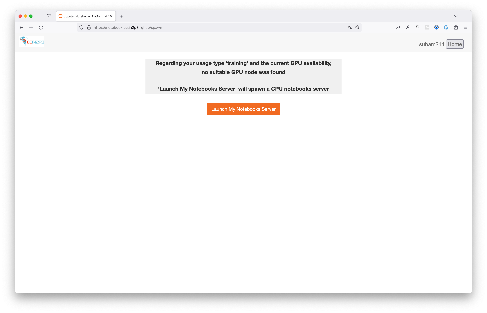
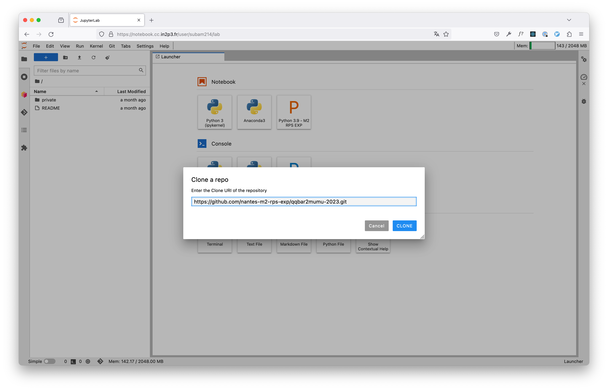
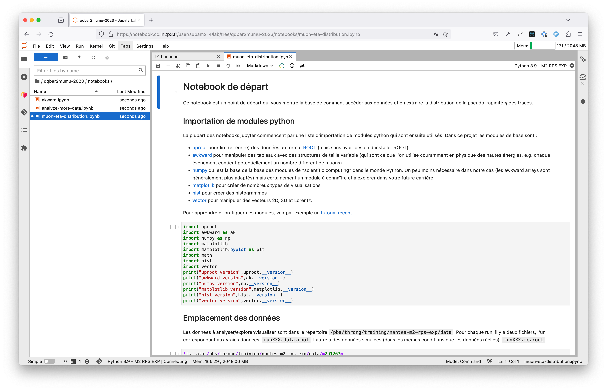

# Comment se connecter à la plateforme Jupyter du CC-IN2P3

Utilisez votre navigateur préféré pour aller sur https://notebook.cc.in2p3.fr, qui devrait ressembler à : 


Cliquez sur le bouton orange "Launch My Notebooks Server". Cela devrait vous emmener vers la page d'authentification du CC-IN2P3 :


Entrez votre identifiant et votre mot de passe (donnés par vos encadrants à la première séance)

Sur l'écran suivant cliquez sur le bouton  orange "Launch My Notebooks Server".



Vous obtenez alors l'écran principal de la plateforme Jupyter 


# A faire après la première connexion

Aller dans le menu `Git -> Clone a Repository` et entrez l'adresse du dépot git qui contient le point de départ de ce projet : 

```shell
https://github.com/nantes-m2-rps-exp/qqbar2mumu-2023.git
```



Notez qu'un répertoire `qqbar2mumu-2023` devrait apparaître dans la partie gauche de l'écran (qui est la partie "explorateur de fichiers"). A l'aide de l'explorateur de fichiers naviguez jusqu'au répertoire `qqbar2mumu-2023/notebooks` et double-cliquez sur `01-muon-eta-distribution.ipynl`. Ceci ouvre votre premier notebook qui vous sera présenté lors de la première séance.


