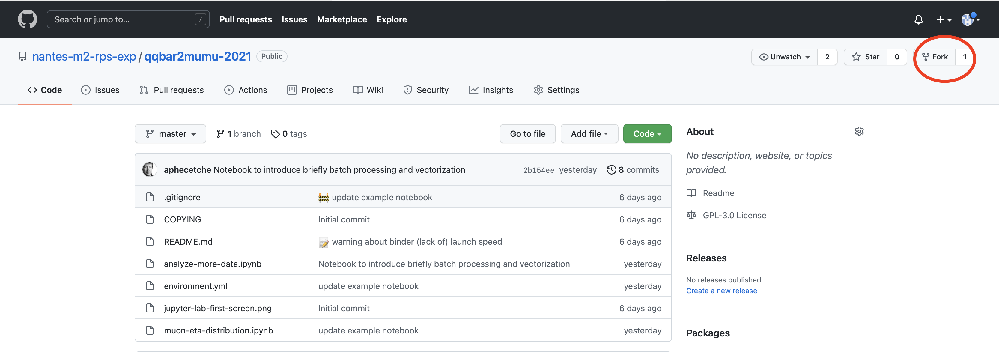
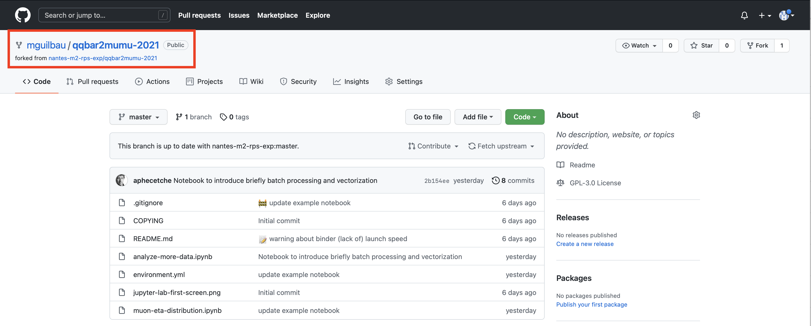

# Téléchargement du dépôt git du projet

Utiliser la commande git suivante :

```shell
git clone https://github.com/nantes-m2-rps-exp/qqbar2mumu-2022.git
```

Par défault, vous êtes sur la "master branch" du projet "origin". Pour pouvoir travailler sur le projet, vous devez effectuer un "Fork" de celui-ci en cliquant sur le bouton en haut à droite :



Une fois le "Fork" réalisé, vous êtes en possession d'une copie complète du projet sur laquelle vous pouvez travailler :



Par la suite, l'adresse de votre projet sur Github [https://github.com/"YOUR_GIT_USER_NAME"/qqbar2mumu-2022.git](https://github.com/"YOUR_GIT_USER_NAME"/qqbar2mumu-2022.git) sera référencée par *myrepo*.
En local sur votre machine, il faut maintenant accéder à cette copie. Pour cela, vous devez utiliser les commandes suivantes :

```shell
git remote add myremote myrepo
git fetch myrepo
```

Ces deux commandes vous permettront de connecter votre environnement de travail local (votre machine) avec votre copie en ligne du projet (remote dont vous avez effectué "Fork").
Pour lister les "remote" disponibles, vous pouvez utiliser la commande :

```shell
git remote -v
```

Lors du développement, il est FORTEMENT conseillé de ne pas travailler sur la branche "master" de votre "Fork" mais de créer une nouvelle branche par tâche.
Pour créer une branche, vous pouvez utiliser la commande suivante :

```shell
git checkout -b "YOUR_BRANCH_NAME"
```

Vous êtes alors automatiquement positionné sur votre branche. Il est conseillé de choisir un nom de branche permettant d'identifier le créateur et contenant une indication sur la tâche que vous souhaitez réaliser sur cette branche. Par exemple un nom de branche pourrait être "guilbaud_distmasseinvariante". Pour lister les branches disponibles :

```shell
git branch 
```

Pour changer de branche :

```shell
git checkout "BRANCH_NAME" 
```

Vous pouvez maintenant commencer à travailler. Pour sauvegarder en local les changements sur vos fichiers, il faut utiliser les commandes :

```shell
git add "FICHIER-X" "FICHIER-Y" "FICHIER-Z"
git commit -m "your message that explains what you have changed" 
```

Pour savoir quels fichiers ont été modifiés et ne sont pas encore sauvegardés par un commit :

```shell
git status
```

Il est important de faire des "commit" le plus régulièrement possible. Cela permet de sauvegarder tout vos changements, de revenir en arrière, etc. Lorsque vous êtes satisfait de votre avancée et à intervalle plus ou moins régulier, vous pouvez envoyer votre code sur votre remote.

Pour cela :

```shell
git push myremote
```

Une fois la tâche terminée, vous pouvez fusionner votre branche avec la "master" branche (en rajoutant vos commits "au-dessus" de master) :

```shell
git checkout master
git pull --rebase
git checkout "YOUR_BRANCH_NAME"
git rebase master
git push myremote
```

Enfin, pour intégrer vos changements au "master" project qqbar2mumu, il vous faudra faire une "pull request" en ligne.
