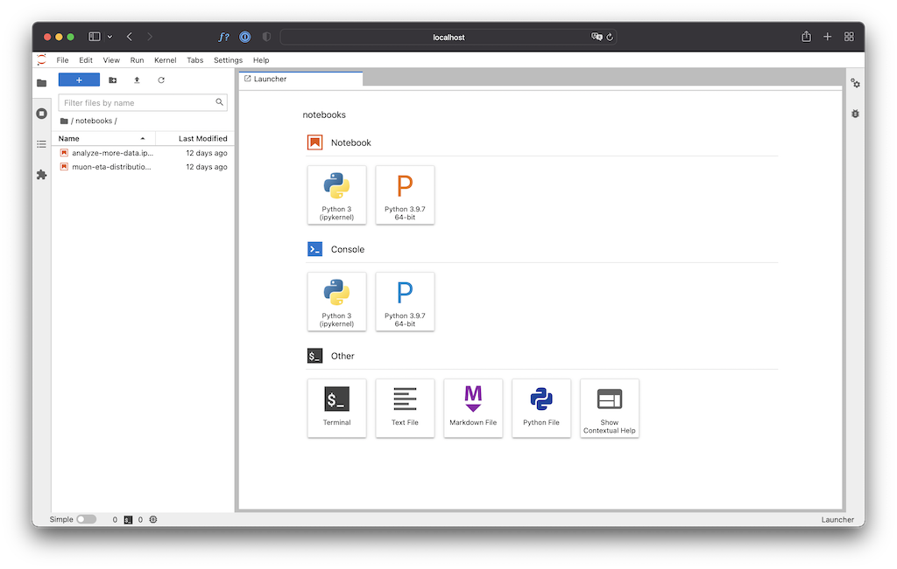

# Installation locale avec Conda

Même si ce n'est pas la seule façon d'installation Jupyter et les dépendences nécessaires à ce projet (ou tout autre projet à base de Python), nous conseillons le recours à [conda](https://docs.conda.io), en particulier via sa version [miniforge](https://github.com/conda-forge/miniforge/#download).

> Attention: ce type d'installation ne permet pas réaliser toutes les opérations nécessaires au projet. Elle permet cependant d'en réaliser une très large fraction. Seules les tâches qui nécessitent des paquets Python spécifiques (avec des interfaces vers du code C++), dont le nom commence par mch (`mchgeo` et `mchtracking` notamment) ne sont pas faisables avec cette installation.

## Installation de miniforge (conda)

Récupérer le [script d'installation](https://github.com/conda-forge/miniforge/#download) correspondant à votre plateforme et exécutez-le. Par exemple sous Linux :

```shell
bash Miniforge3-Linux-x86_64.sh
```

Suivez les instructions (en résumé : ENTER - SPACE - yes - ENTER - yes).

A l'issue de cette étape la commande `conda` est maintenant disponible (vous devrez peut-être vous déconnecter et reconnecter pour la voir).

```shell
conda help
```

## Installation des paquets de base avec conda

Ce dépot contient un fichier [`environment.yml`](environment.yml) qui décrit les dépendences utilisées par le notebook d'exemple (`muon-eta-distribution.ipynb`) que vous utiliserez pour vous mettre dans le bain.

Avec conda (et plus généralement avec Python) il est très fortement recommandé de travailler dans un "environnement" (qui décrit un ensemble de modules Python et leurs versions respectives). Pour ce faire il faut installer l'environnement (une seule fois) :

```shell
conda env create -f conda/environment.yml
```

puis l'activer pour l'utiliser (à chaque connection/déconnection).

```shell
conda activate qqbar2mumu
```

Une fois l'environment activé, vous pouvez lancer Jupyter lab

```shell
jupyter lab
```

Ce qui lance une application web dans votre navigateur :



Double-cliquez sur `notebooks` puis sur `muon-eta-distribution.ipynb` dans le panneau de gauche et vous êtes prêts à démarrer !
Pensez à sauvgarder vos changements le plus souvant possible. Pour quitter le notebook, il suffit de faire "Fichier/LogOut".

